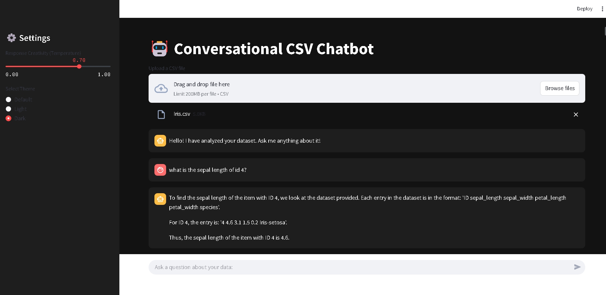
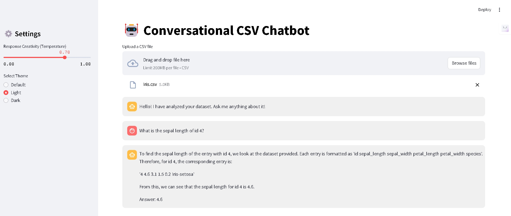

## 🚀 **Conversational CSV Chatbot using LLM API**

This project is an interactive CSV-based chatbot powered by an LLM API. It enables users to upload CSV datasets and ask natural language questions about the data. The chatbot processes the dataset, understands user queries, and provides insightful responses in a conversational manner.

##✨ **Features**

✅ Conversational AI – Supports contextual memory for follow-up questions

✅ Dynamic Theme Switching – Light, Dark, and Default modes

✅ Real-Time Chat Features – Typing indicator and auto-scrolling

✅ Adjustable Response Creativity – Temperature control for responses

✅ Optimized API Integration – Ensures accurate and relevant answers

✅ Streamlit-Based UI – Provides a seamless user experience

## 🔧 **Setup Instructions**

1️⃣ **Install Dependencies**

Ensure you have Python installed, then run:

pip install -r requirements.txt

2️⃣  **Configure API Credentials**

Create a .env file in the project directory and add:

API_URL=your_llm_api_url

API_KEY=your_llm_api_key

MODEL_NAME=your_model_name

3️⃣ **Run the Chatbot**

streamlit run app.py

## 📸 **Screenshot**

## 🤖 **How It Works**

1) Upload a CSV file

2) Ask questions in natural language

3) The chatbot processes the query and retrieves relevant insights

4) Follow up with additional queries while maintaining context

## 📜 **License**
This project is licensed under MIT License.

